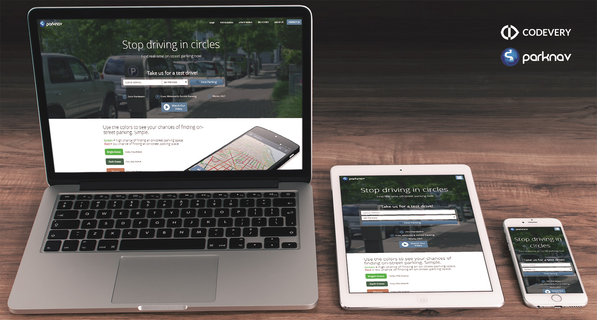
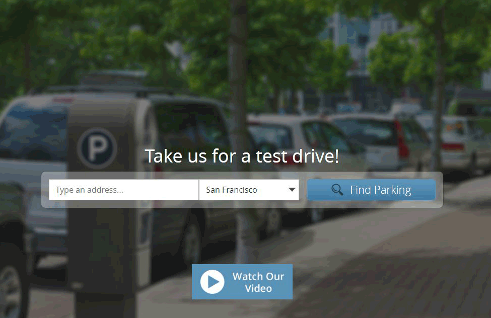

# ParkNav (Frontend developing)

Demo live: [project.parknav.codevery.com](http://project.parknav.codevery.com/)



In this project I used 2 **pre-processor** of front-end developing.
* Jade - pre-processor for HTML template. I used **jade** to include template part to prepare whole template.
* Scss / Sass - pre-processof for CSS. This feature used to create comfortable tree of stylesheet with custom function. Also able to override bootstrap variables.

## Features
### Animation
Items is animated when pages is loaded.   
The Layout appears to each animated item with @mixin **v-translate**. It's a custom function called from **_vars.sass**


layout.sass:340
```sass
li
  @include v-translate3d(0, 40, 0)
  opacity: 0
  margin: 5px 0
  &.ready
    @include v-translate3d(0, 0, 0)
    opacity: 1
    &:nth-of-type(1)
      @include v-supertrans($x * 1, 0.82, 0.01, 0.63, 0.79)
    &:nth-of-type(2)
      @include v-supertrans($x * 2, 0.82, 0.01, 0.63, 0.79)
    &:nth-of-type(3)
      @include v-supertrans($x * 3, 0.82, 0.01, 0.63, 0.79)
```
_vars.sass:48
```sass
@mixin v-translate3d($x:0, $y:0, $z:0, $data: 0)
  $a: 0
  @if $data == 1
    $a: $x, $y, $z
  @else
    $a: $x *1px, $y *1px, $z *1px
  -webkit-transform: translate3d($a)
  -moz-transform: translate3d($a)
  -ms-transform: translate3d($a)
  -o-transform: translate3d($a)
  transform: translate3d($a)
```

## IDE and Tolls
* PhpStorm
* Adobe PhotoShop
* NodeJS pre-processor
* Apache2
* Git

## Structure
It's a first step to successful start the project.
* **assets**
    * **bootstrap** - core of bootstrap scss
    * **css** - directory with all stylesheets
        * ***_fonts.scss*** - part of layout
        * ***_vars.sass*** - all variables of stylesheet layout
        * ***bootsrap.sass*** - bootstrap file extends bootstrap core, the file override default bootstrap theme
            * **bootstrap.css** - compiled bootstrap via pre-processor
        * ***layout.sass*** - main layout which include variables, fonts 
            * **layout.css** - compiled stylesheet
    * **js**
        * **jQuery** - JS library 
        * **Moment js**
        * **google analytics**
        * **date-time picker**
    * **img** - images which included in project
* **includes**
    * ***_footer.html*** - part of template of Footer
    * ***_head.html*** - part of template of Head
    * ***index.html*** - part of body of index page
    * ***privacy.html*** - part of body of privacy page
* *.htaccess* - configuration for Apache server. Mod-rewrite for pretty url without .html extension, like a /privacy
* ***index.jade*** - pre-processor for Jade file, which included _head, _footer and index.html as body of page
    * **index.html** - compiled index file and ready to render in browser
* ***privacy.jade***
    * **privacy.html**

